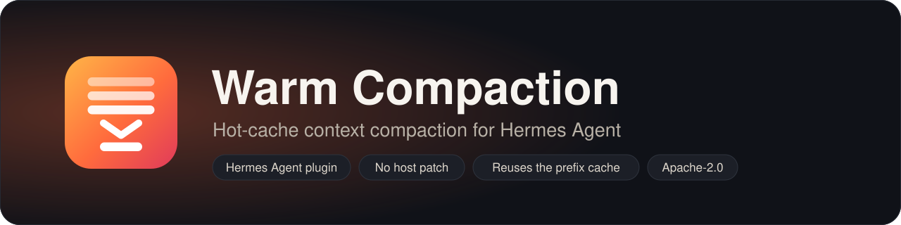
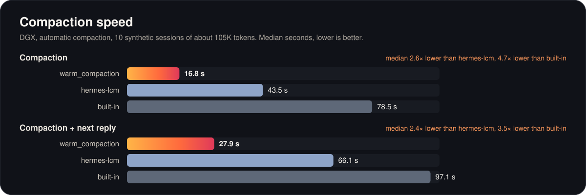
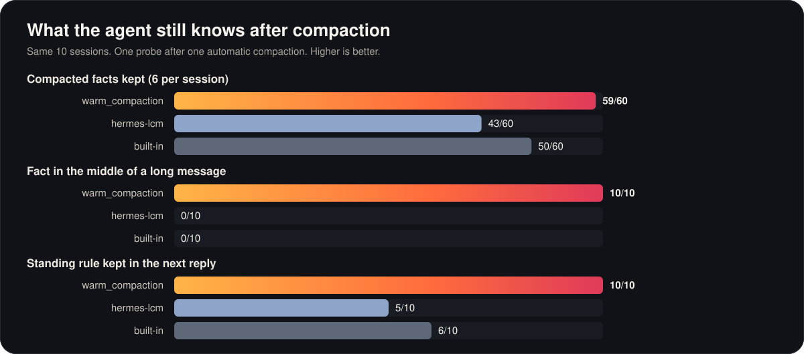
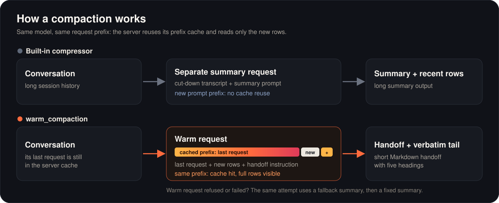

<p align="center">
  
</p>

<p align="center">
  <a href="https://github.com/Elevatormusic/hermes-warm-compaction/actions/workflows/tests.yml"></a>
  <a href="https://github.com/Elevatormusic/hermes-warm-compaction/actions/workflows/lint.yml"></a>
  <a href="LICENSE"></a>
  
  <a href="https://github.com/NousResearch/hermes-agent"></a>
  
</p>

<p align="center">
  <a href="#install">Install</a> ·
  <a href="#how-it-works">How it works</a> ·
  <a href="#results">Results</a> ·
  <a href="#settings">Settings</a> ·
  <a href="#limits">Limits</a>
</p>

`warm_compaction` is a context engine plugin for [Hermes Agent](https://github.com/NousResearch/hermes-agent). At each compaction, the main model writes the handoff summary on the cached prefix of its last request. The server reads only the new rows, so the compaction is faster.

It works on unpatched Hermes Agent. It uses documented plugin APIs only: no host patch, no subclass of the built-in compressor, and no runtime wrapping of Hermes code.

<a id="warm_compaction-vs-hermes-lcm-vs-built-in"></a>

<p align="center">
  
</p>

<p align="center">
  
</p>

<p align="center"><sub>Synthetic sessions of about 105K tokens on a DGX server, ten cases. Method, all measures, and limits: <a href="#results">Results</a>.</sub></p>

## Quick start

Run these commands in a terminal (PowerShell, Terminal, or any shell) where the `hermes` command works: the same place where you start Hermes. Do not type them in a Hermes chat.

1. Install and enable the plugin:

   ```bash
   hermes plugins install Elevatormusic/hermes-warm-compaction#warm_compaction --enable
   ```

2. Select the engine:

   ```bash
   hermes config set context.engine warm_compaction
   ```

   This writes the setting to your Hermes `config.yaml` (`hermes config path` shows where it is). You can also edit the file yourself (`hermes config edit`):

   ```yaml
   context:
     engine: warm_compaction
   ```

3. Start a new Hermes session. Each compaction writes one `warm_compaction:` line to `logs/agent.log` in the Hermes home folder.

## How it works

<p align="center">
  
</p>

At each compaction, the plugin sends the last main-model request of the session again. It adds the rows that came after that request and one handoff instruction at the end. This is the *warm request*. The server can reuse the cached prefix of the earlier request, so it reads only the new rows. The reply is a Markdown handoff with five headings: Goal, User instructions, Current state, Key facts, and Next step. The plugin replaces the older rows with the handoff and keeps a verbatim tail of recent rows.

If the warm request cannot run, or if its reply fails the gate, the same compaction attempt uses a fallback summary through the Hermes auxiliary model route. If that also fails, the plugin writes a fixed-format summary without a model request; it keeps the newest earlier summary as a quote. When Hermes cancels an attempt, the history stays unchanged.

The plugin does this for manual `/compress` and for automatic compaction.

**The speedup needs the same model and a prefix cache.** The warm request goes to the main model route. It runs on any OpenAI-compatible server, but it is faster only when that server reuses its prefix cache. The fallback summary can use a different model.

| Server | Prefix cache | Reports `cached_tokens` |
| --- | --- | --- |
| Hosted APIs with prompt caching | yes | yes |
| vLLM | yes (default) | only with `--enable-prompt-tokens-details` |
| SGLang | yes, radix cache (default) | only with `--enable-cache-report` |
| TensorRT-LLM `trtllm-serve` | yes, KV block reuse | yes |
| llama.cpp `llama-server` | yes, per slot | yes |
| MLX `mlx_lm.server` | yes | yes |
| Ollama (`/v1`) | yes | no |
| LM Studio | yes | no |

From the server documentation and issue trackers; tested here only on DGX and LM Studio. Where the server does not report the counter, the log shows `cached_tokens=None` (unknown). With llama.cpp `--parallel` above 1, the warm request can go to a different slot and miss the cache.

## Requirements

- Hermes Agent `45871e10` (2026-10-02) or a later version that keeps the plugin APIs that the plugin uses. At load time, the plugin checks for each API. If an API is missing, the plugin registers nothing, writes a warning to the log, and Hermes keeps its built-in compressor.
- For the warm path: `chat_completions`, `codex_responses`, or `anthropic_messages`, with a supported request and authentication route. See [Provider support](docs/provider-support.md) for the tested scope. Other formats use the fallback summary.
- Python 3.10 or later. No third-party package.

## Install

Ask your agent:

```text
Install this plugin and set it up: https://github.com/Elevatormusic/hermes-warm-compaction
```

To install it yourself, run this command in a terminal on the computer where Hermes runs, then [select the engine](#select-the-engine):

```bash
hermes plugins install Elevatormusic/hermes-warm-compaction#warm_compaction --enable
```

The `#warm_compaction` part selects the plugin folder in the repository. To install a specific commit, add `--ref <40-character commit SHA>`. To install without enable, use `--no-enable`, then `hermes plugins enable warm_compaction`.

The install runs the Hermes security scan and the plugin checks. The plugin passed them in the [integration check](evidence/plugin-integration.json).

## Select the engine

Hermes never selects a context engine automatically. Select it one time:

- `hermes plugins`, then Provider Plugins, then Context Engine, then `warm_compaction`; or
- set this value in `config.yaml`:

```yaml
context:
  engine: warm_compaction
```

Start a new Hermes session after the change.

## Native warm handoff

Some Hermes versions include warm handoff in the built-in compressor. This plugin checks the installed
constructor and default configuration for that feature. It does not use a release number or the merge state
of a pull request. Updating Hermes keeps `context.engine: warm_compaction` selected.

Update this plugin to get the notice. When the feature is available, the plugin supplies one notice through
the automatic compaction status API for each engine instance. A pending warm-request failure warning has
priority; the native notice stays pending for the next permitted status. Session reset and warm-path recovery
do not repeat the notice. A new engine instance, including a clone, gets its own notice.

Hermes controls how each surface shows automatic status. The plugin keeps the notice pending when the API
suppresses status, but it cannot detect suppression after it returns the text. This is not a startup banner
or a guaranteed notice on every surface. Manual `/compress` does not use this status API. The first actual
compaction also writes the notice once to `logs/agent.log` for each engine instance. There is no persistent
notice record, configuration change, or conversation message.

To use native warm handoff, set these values in your Hermes configuration and restart Hermes:

```yaml
context:
  engine: compressor
compression:
  warm_handoff: "on"
```

The native default is `"off"`. `"on"` tries the warm request when a usable captured request is available.
`"auto"` also requires the compression summary route to use the main model, reported cached prompt tokens
greater than zero, and a captured request no more than five minutes old. A server that does not report cached
tokens needs `"on"` to try the native warm path. Refused or failed warm requests use the normal auxiliary summary.
The native mode keeps the built-in history policy, so retained history can differ from this plugin.

## Settings

The settings are in `plugins.entries.warm_compaction.settings`. An invalid value uses the default and writes a warning to the log.

| Key | Type and range | Default | Use |
| --- | --- | --- | --- |
| `threshold` | float, 0.10 to 0.95 | 0.50 | Fraction of the context window at which automatic compaction starts |
| `tail_tokens` | int, 0 or more | 0: 2.5% of the context window, from 10,000 to 25,000 | Size of the verbatim tail, at most half of the compaction threshold |
| `user_copy_chars` | int, 0 or more | 24,000 | Total characters of user messages that the summary copies |
| `warm` | bool | true | Set false to use only the fallback summary, for comparison runs |

```yaml
plugins:
  entries:
    warm_compaction:
      settings:
        threshold: 0.5
```

On Chat Completions routes, the warm request sends the whole earlier request again, plus the new rows and the reply reserve. The reply limit of the warm request is the `max_tokens` or `max_completion_tokens` value of the earlier request, kept between 2,048 and 8,192 tokens. If the earlier request had no limit, the warm request gets 8,192 tokens in the field that Hermes uses for the route (`max_completion_tokens` for OpenAI, Azure OpenAI, GitHub Copilot, and the newer OpenAI models; else `max_tokens`). The warm request sends the default headers of the Hermes client for the route: the provider headers, `model.default_headers`, and `providers.<name>.extra_headers`. It also keeps a captured `x-opencode-session` request header. Hermes can add this header automatically for OpenCode routes. The captured value stays in memory and overrides a default header with the same name, without regard to case. It goes through both middleware checks and is sent as an HTTP header, never as a JSON field. It uses the `ssl_ca_cert` of a custom provider route. A route with `ssl_verify: false` uses the fallback summary (refusal code `tls_unverified`): the plugin does not send without certificate checks. Thus it must fit in the context window. At the default threshold, about half of the window stays free for it. If the request does not fit, the plugin uses the fallback summary (refusal code `capacity`). The plugin uses the prompt token count that the server reported for the earlier request, and estimates only the new rows.

## Fallback model and keys

The fallback summary uses the auxiliary task `warm_compaction`. Set `auxiliary.warm_compaction.provider` and `auxiliary.warm_compaction.model` to use a different model. The default `auto` uses the main model route. The fallback reply must end with the line `[END OF SUMMARY]`: the auxiliary route reports no finish reason, so a reply without that line counts as cut off. The warning uses `missing_end_marker` when the final line is absent, or `output_token_limit` when the reported output count reaches the 2,048-token limit. A marker earlier in the reply does not pass the check. These cases still use the fixed summary; the plugin cannot confirm completion from the five headings alone. The fallback request is at most about 11,000 tokens: a transcript of about 8,000 tokens, the instruction, and a 2,048-token reply. The focus topic and the memory context are cut to about 1,000 tokens and take their size from the transcript. A fallback model needs a context window of at least 16,000 tokens. Hermes accepts main models with 64,000 tokens or more, so the default route has enough space.

For a custom endpoint that needs a key, put the key name in the model settings:

```yaml
model:
  provider: custom
  base_url: https://example.invalid/v1
  key_env: MY_ENDPOINT_KEY
```

The warm request uses the key that Hermes gives to the engine. The fallback request goes through the Hermes auxiliary route, which reads the key from `model.key_env` or `model.api_key`. Without one of them, Hermes sends the placeholder key `no-key-required`, and a server that needs a key refuses the fallback request. A host that gives the key only in code, for example `AIAgent(api_key=...)`, cannot give it to the fallback request.

## Check the result

Hermes writes compaction metadata to `logs/agent.log` in the Hermes home folder:

```text
warm_compaction: path=warm reason=accepted elapsed_s=10.656 prompt_tokens=108021 cached_tokens=107968
```

- `path` is `warm`, `fallback`, or `fixed`. `unchanged` means that an indivisible native replay block left no room for a valid new history; no compaction was committed.
- `reason` is `accepted` or the refusal code of the warm request: `disabled`, `no_capture`, `api_mode_unsupported`, `auth_unsupported`, `route_changed`, `settings_unsupported`, `request_not_mapping`, `request_options_unsupported`, `request_not_json`, `source_transform_unsupported`, `history_changed`, `capacity`, `cancelled`, `middleware_unavailable`, `middleware_refused`, `middleware_rewrite`, `middleware_repeated`, `middleware_after_capture`, `middleware_order_unknown`, `headers_unknown`, `tls_unknown`, `tls_unverified`, `middleware_changed_reply`, `provider_error`, `timeout`, `incomplete_response`, or `gate:<reason>`. The warm request goes through the Hermes `llm_request` and `llm_execution` middleware, as a main request does.
- `cached_tokens` is `None` when the server does not report it. Then the cache reuse is unknown.

Capture refusal codes identify the failed check: `request_not_mapping` means that the request is not a mapping; `request_options_unsupported` means that extra headers, query options, or `extra_body` cannot be kept; `request_not_json` means that a body value cannot be sent as JSON (including NaN and infinity). `settings_unsupported` still applies to unsupported model settings. These codes contain no request values.

The engine status (`get_status()`) has the same values in `warm_last`. After a new attempt starts, an older worker cannot replace this status or write a final metadata line. The log never contains message text, request bodies, or keys.

Manual `/compress` can report `No changes from compression` when all messages fit in the recent-history tail. Then the plugin has no older history to summarize. The request estimate also includes system instructions and tool definitions, which the plugin does not compress. Use `/context` to see the token counts for each part. This unchanged result does not count as a warm-path failure.

### When the warm path keeps failing

When the warm summary cannot be used, the plugin tries the fallback summary. If that summary cannot be used, it uses the fixed summary. The plugin reports these results:

- Each saved compaction that Hermes confirms without the warm path writes a WARNING with its reason, for example `Warm compaction skipped (provider_error); used the fallback summary`. Hermes copies warnings to `logs/errors.log`.
- A host compatibility failure (`middleware_order_unknown` or `middleware_unavailable`) prepares a notice after the first confirmed failure. It identifies the failed Hermes check and the summary path used. It does not wait for three failures.
- After 3 confirmed compactions in a row without the warm path, the plugin writes one WARNING with a hint for each distinct reason. When automatic engine status is enabled, Hermes shows the notice at the next automatic compaction. The notice has no routine progress text, so a gateway filter for that text does not discard it. Later confirmed failures update the pending notice until Hermes shows it. For example:

  ```text
  ⚠ Warm compaction unavailable: the last 3 compactions did not use the warm summary (provider_error: the server refused the warm request (a provider error, or a gateway that needs a cookie)). Compaction continues with the fallback summary. Details: the warm_compaction lines in logs/agent.log.
  ```

- When the fallback summary could not be used, the notice says how many times, and that those compactions used the fixed summary (no model, less detail).
- A warm summary can fail the handoff checks even when the server reports cached tokens. The notice describes the summary result. It does not prove a cache miss, a speed change, or that all details were kept.
- A confirmed warm compaction or a session reset ends the streak. The notice can then show again at the first host compatibility failure, or after 3 other failures. A cancelled or rejected attempt does not count or clear the streak, and `warm: false` is not a failure.
- When the engine's automatic status is disabled, warnings stay in the logs. The engine keeps a pending notice until status is enabled or a confirmed warm compaction or session reset clears it.
- The streak belongs to one engine instance. It is not saved across a restart or shared with separate gateway manual-command engines. A host that sends no successful compaction notification has attempt metadata only.
- Manual `/compress` has no status line from the engine: after manual compactions only, the notice is in the logs.

## Results

All runs used synthetic conversations of 100,000 or more prompt tokens on unpatched Hermes `45871e10`, one session at a time. The records have metadata only. "DGX" is an OpenAI-compatible server on an NVIDIA DGX that reports cached tokens. "LM Studio 4B" is LM Studio with a Qwen3.5 4B model; it reports no cached-token counter.

**Plugin against the built-in compressor** ([record](evidence/plugin-live.json)), ten cases per engine and mode, median seconds:

| Engine | Mode | Warm path accepted | Compaction, plugin / built-in | Compaction + next reply, plugin / built-in |
| --- | --- | --- | --- | --- |
| DGX | manual | 10/10 | 10.2 / 32.7 | 12.5 / 36.9 |
| DGX | automatic | 10/10 | 10.1 / 39.9 | 11.5 / 42.9 |
| LM Studio 4B | manual | 9/10 | 20.9 / 34.4 | 25.2 / 64.5 |
| LM Studio 4B | automatic | 9/10 | 21.1 / 41.8 | 25.7 / 54.9 |

On DGX, each warm request read about 108,000 prompt tokens, and the server reported at least 99.9% of them as cached.

**Plugin, hermes-lcm 0.21.0-rc2, and the built-in compressor** ([record](evidence/lcm-bench.json)), DGX, automatic compaction, ten cases: see the [charts at the top](#warm_compaction-vs-hermes-lcm-vs-built-in).

<details>
<summary>Table with all measures</summary>

| Measure | Plugin | hermes-lcm | Built-in |
| --- | --- | --- | --- |
| Compaction, median (s) | 16.8 | 43.5 | 78.5 |
| Compaction + next reply, median (s) | 27.9 | 66.1 | 97.1 |
| Compacted facts correct | 59/60 | 43/60 | 50/60 |
| Fact in the middle of a long row | 10/10 | 0/10 | 0/10 |
| Standing rule kept (next reply) | 10/10 | 5/10 | 6/10 |
| Control fact (in the recent rows) | 10/10 | 10/10 | 10/10 |
| Next action, action and target | 9/10 | 9/10 | 10/10 |

The charts come from the record: `python assets/make_charts.py`.

</details>

The plugin was faster than both other engines in 10 of 10 cases. hermes-lcm and the built-in compressor cut long messages before they summarize them. The warm request lets the main model read the full rows.

### Limits of the results

- One synthetic task family, one session shape, and one model per engine.
- The cache reuse depends on the server. The plugin cannot force it. On LM Studio, the cache reuse is unknown, and part of the gain comes from the smaller new history.
- The results describe these versions and settings only.

## Limits

- The warm path needs a captured main-model request in the current Hermes process. After a restart or a resume, the first compaction uses the fallback summary if no main-model request completed before it (`no_capture`).
- The warm request uses its own HTTP connection. It sends the route URL (with its query, for example an Azure `api-version`), the route headers, and the TLS settings, but not the cookies of the Hermes client. A gateway that needs a cookie from an earlier response refuses the warm request, and the fallback summary runs (`provider_error`).
- A model or session switch, or a host timeout, during the attempt stops it, also while the warm request is on the network: the history stays unchanged (`route_changed` or `cancelled`).
- A provider or API key switch forgets the capture of the session: the next compaction uses the fallback summary (`no_capture`) until a main request on the new configuration completes. A key that Hermes gives as a function can change without a switch (a token that refreshes or rotates): the capture keeps a PBKDF2-HMAC-SHA-256 digest of the key that sent it, never the key, and the warm request is not sent with another key (reason `credential_changed`). The digest uses a random salt made when the plugin module loads. The salt and the captures stay in memory. A key change while a request is open keeps no capture.
- A captured row with a field that Hermes does not send for the stored row (other than the prompt caching marker `cache_control`) refuses the warm path (`source_transform_unsupported`).
- On Chat Completions routes, the source check accepts exact text or removal of trailing whitespace from a complete text string, including a stored `api_content` string. Leading or inner whitespace changes, added whitespace, and changes to text inside a content list still refuse the warm path (`source_transform_unsupported`). The captured request prefix stays unchanged.
- Responses and Anthropic Messages use their own source checks. Native signed and encrypted replay records stay whole and count in tail estimates. A record that leaves no room for a valid new history returns the original history with `path=unchanged reason=capacity`. See [Provider support](docs/provider-support.md).
- The handoff must start with `## Goal`: text before the first heading is refused (`gate:heading_preamble`).
- The verbatim tail keeps the newest rows that fit in `tail_tokens`, and in the free room after the system rows and tool schemas of a usable capture, the reply reserve, and a summary: a large system prompt can make a short history compact. It stops at the first older row that does not fit, and that row goes into the summary. When the newest unit alone is larger than the tail or the free room, its largest sent payloads keep only their start and end: message text, tool call arguments (kept as a JSON object), and reasoning text. A large image or other media part is replaced by its attachment mark: a web URL or a file name stays (at most 200 characters), a data URL does not. If the cuts are not enough, the payloads are dropped, largest first; only the row structure stays. Signed `reasoning_details` stay as they are. The fallback summary gets the cut middles, and the fixed summary quotes them (at most 8,000 characters), also the cut middle of a long latest user message that goes in front of the tail. A fallback summary above its 4,096-token reserve (a dense CJK summary, for example) is not used: the fixed summary quotes the parts that the final tail cuts. Each quote makes the fixed summary larger and the tail smaller; after 10 rounds, the tail is cut at the size that the summary quotes, also when that is a little above the free room. The sizes come from the fields that Hermes sends: row metadata does not count; reasoning counts only on a route that needs it back (DeepSeek, Kimi, MiMo thinking; a capture of the route shows it, else a stored row with `reasoning_content`); `reasoning_details` counts only on a route that replays it, without the private native-assistant entries; the native-assistant entry type that the provider profile declares (`native_reasoning_details_type`) counts on every route of the provider, as Hermes replays it; a tool call counts only its id, type, name, and arguments, and a usable thought signature counts only for a Gemini or Gemma model. The fixed summary keeps bounded quotes of the earlier summary, the focus topic, the memory context, and the cut middles; together with the tool inventory (the most used names, and one count for the others) they stay in one budget (4,096 tokens, and at most the free room). When the fallback summary is used and the latest user request in front of the tail must be cut, the cut middle goes after the summary as a bounded quote, in what the summary budget has left: the fallback transcript had only the start and end of a long row. When no quote fits there, the fixed summary is used: it quotes the cut middle. A fallback summary that does not fit in the free room is not used: the fixed summary takes its place. A model, session, window, or threshold change at any time during the compaction discards its result (reason `route_changed`). On a Gemini or Gemma route, a tool call with a thought signature stays whole: Gemini needs it back as it was. A change of the provider or the key forgets the capture, also from an empty provider and key. A warm summary that does not fit in the free room (a dense reply under a low threshold, for example) is not used: the fallback summary runs (reason `summary_too_large`). A retry middleware cannot send the warm request a second time, also after a failed send. A warm reply body above 1 MiB is not read (reason `response_too_large`). The fallback request does not start after a model, provider, or session switch. The plugin API has no request on a fixed route (an override needs a trust setting), so a switch in the short time after that check, before the host resolves the auxiliary route, can still send the transcript to the new route. Reasoning is cut only when a usable capture of the route shows that the route sends it: other reasoning (of an earlier route after a model switch, for example) does not go to the fallback model or into the fixed summary. The latest user request in front of the tail gets the room that stays after the tail is cut. Hermes notifications, task lists, and recovery nudges are not user requests only when the whole text matches the Hermes template. The copied user messages get the room that stays after the tail is cut. Without a usable capture (after a restart, after a model change, or when a middleware changed the captured rows), the request overhead is unknown: the summary has no copied user messages, the summary, the prepended row, and the tail take at most half of the free room, the check before a request compacts when the history estimate reaches half of the window less the reply reserve, and the reply reserve is a quarter of the window (at most 65,536 and at least 4,096 tokens). The same reserve applies when the captured request had no positive `max_tokens` or `max_completion_tokens`: the provider default is not known. The host token count is not used for the overhead: it does not use the plugin tokenizer.
- Responses warm requests are streamed; Chat Completions and Messages warm requests are not streamed. No warm request is retried. Its time limit is 120 seconds. The fallback request also has a 120-second limit. Native formats have additional limits in [Provider support](docs/provider-support.md).
- On Chat Completions routes, per-request `extra_headers` supports only one `x-opencode-session` header, with a non-empty plain ASCII string value, no control characters, and no leading or trailing space. Other headers, duplicate names with different case, non-empty `extra_query`, or an invalid `extra_body` use the fallback (`request_options_unsupported`). A JSON `extra_body.extra_headers` field cannot be combined with the session header. A request with `n` above 1, a forced `tool_choice`, `response_format`, or audio settings uses the fallback (`settings_unsupported`).
- After `/compress`, Hermes builds the system prompt again from its configuration. A system message that a host gave in code is not kept. This is Hermes behavior, and it is the same for the built-in compressor.
- Each new agent writes this Hermes warning to the log: `Context engine 'warm_compaction' loaded but no engine instance found`. Hermes first tries its context engine loader, which cannot make this engine. Then Hermes uses the engine of the enabled plugin. The warning has no effect.

## Rollback

Set the built-in compressor again and start a new Hermes session:

```yaml
context:
  engine: compressor
```

The new history uses summary rows that Hermes recognizes. The [integration check](evidence/plugin-integration.json) checked a rollback with the plugin still enabled: the built-in compressor loaded the saved history and compacted it again with its own summary. To remove the plugin, use `hermes plugins disable warm_compaction` or `hermes plugins remove warm_compaction`.

## Hermes update compatibility

A future Hermes update can change an API that this plugin uses. The plugin currently reads the private middleware registry to confirm that no execution middleware runs after its capture. A later middleware could send a different request, so removing this check would make the capture unsafe. If the order cannot be checked, the plugin refuses the warm path and uses a fallback. Fallback summaries can omit details; they are not a guarantee of complete retention.

The [compatibility workflow](.github/workflows/hermes-compatibility.yml) tests the real Hermes middleware, plugin install, native provider requests, and native conversation loop against the minimum supported revision and upstream `main`. It runs on pull requests, pushes to `main`, each day, and by manual dispatch. Each report records the exact Hermes commit and plugin file hashes. The checks use synthetic data and a loopback server. Native failures fail the job; an upstream change is not skipped. A failed workflow needs review; it does not update or change an installed Hermes. GitHub Actions notification settings control failure notifications.

The check uses synthetic requests and a fake provider callback. It checks capture ordering, request changes before and after capture, and refusal when ordering cannot be read. It does not call a model. Run it with a Hermes dependency interpreter and a clean, isolated source checkout:

```bash
<hermes-venv-python> -B scripts/check_hermes_compatibility.py --hermes-source <clean-hermes-checkout> --report .work/hermes-compatibility.json
```

The middleware check alone does not prove full conversation-loop compatibility or a cache benefit. Before adopting a Hermes update, also run the plugin and native checks in [Contributing](CONTRIBUTING.md#run-the-checks). Check `path`, `reason`, and available token counters in an isolated synthetic session. Keep the last working Hermes version available until these checks pass.

To remove the private ordering dependency, Hermes needs a documented execution-middleware contract that tells each callback whether another callback follows it. That information must come from the same chain snapshot that the request executes. It must not be inferred from a separate registry read or from request text. The current Hermes API does not provide it. This plugin does not patch Hermes or assume that this proposed API exists.

## Development

Run the unit tests from the repository root:

```bash
python -m unittest discover -s tests -p "test_wc_*.py"
```

Run the integration check on a clean Hermes checkout with the Python of the Hermes virtual environment:

```bash
<hermes-venv-python> -B scripts/check_plugin_hermes.py --hermes-source <clean-hermes-checkout> --report .work/plugin-integration-report.json
```

The integration check installs the plugin with the Hermes install command in a temporary Hermes home. It runs real Hermes conversation and compaction code against a loopback fake server, and it sends no request to a real model. An audit-hook fence blocks other network access, child processes, and writes outside the scenario folder. The report has metadata only.

For native provider edits, run both `scripts/check_provider_apis.py` and `scripts/check_native_conversations.py`. The second check covers the real agent loop, manual and automatic compaction, native tool rounds, and saved-session reload. See [Provider support](docs/provider-support.md#retained-history-and-checks) for commands and limits. The [contribution guide](CONTRIBUTING.md#run-the-checks) also gives the Hypothesis property tests and branch coverage commands. Test tools are separate from the plugin's runtime dependencies.

## Contributing

Bug reports, server results, and pull requests are welcome. See [CONTRIBUTING.md](CONTRIBUTING.md) for the checks, and [SECURITY.md](SECURITY.md) to report a vulnerability privately. Changes are listed in [CHANGELOG.md](CHANGELOG.md).

## License and credit

Apache License 2.0. See [LICENSE](LICENSE) and [NOTICE](NOTICE). A copy, a port, or a derivative work of this code must keep the NOTICE file. If you use this design in Hermes Agent or in a different project, please credit Elevatormusic and link to this repository.
